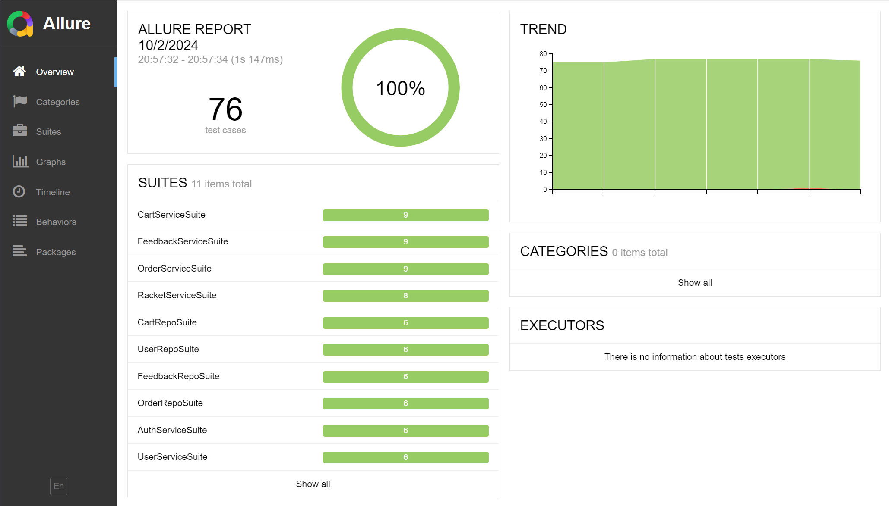
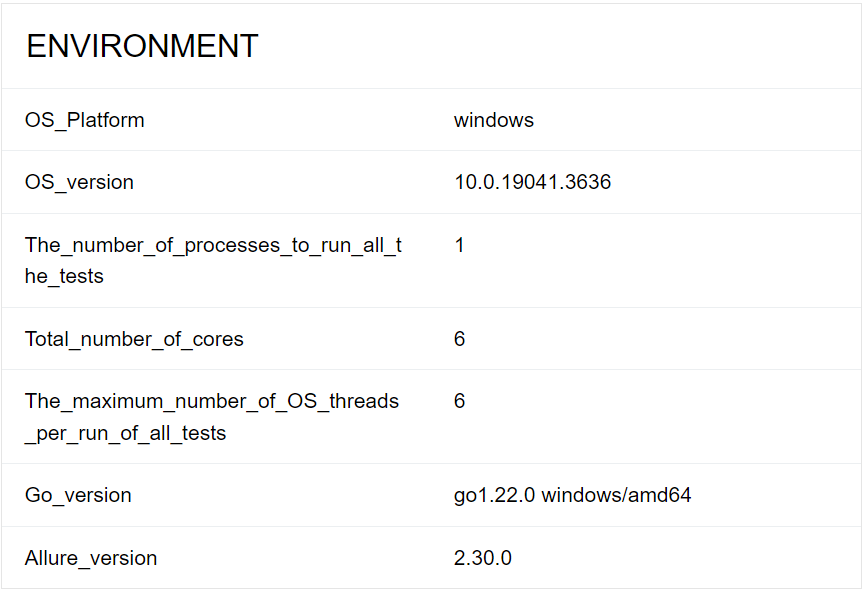
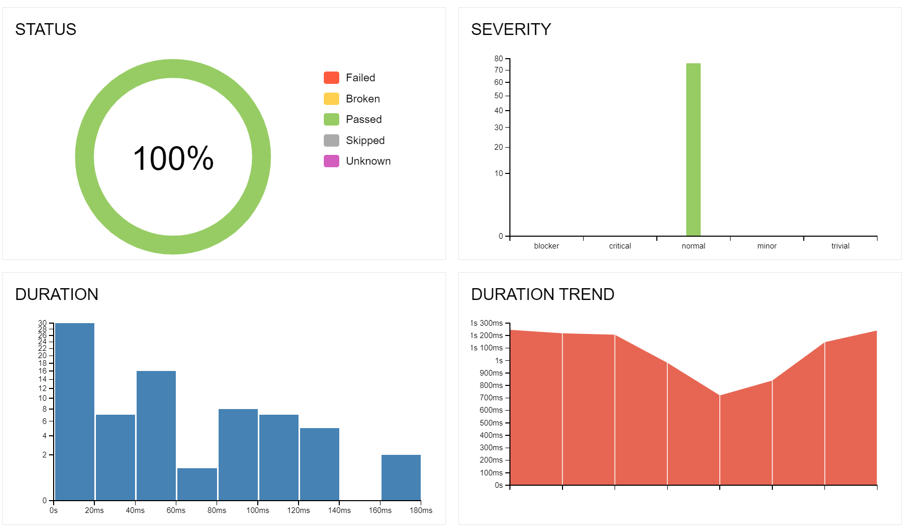
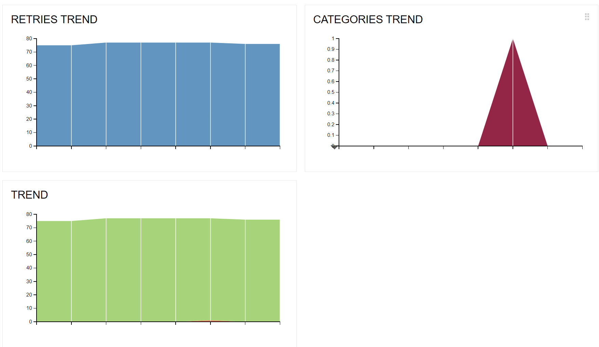

# Testing

## Технологический стек
- язык: golang
- библиотека для тестирования: testing
- библиотека для генерации отчета: allure-go

## Запуск тестов
```make
go test -v ./... -shuffle=on --race --parallel 6
```
- -shuffle=on - запуск тестов в произвольном порядке
- --race - проверка на гонки данных
- --parallel 6 - создание 6 процессов

## Отчет по тестированию







